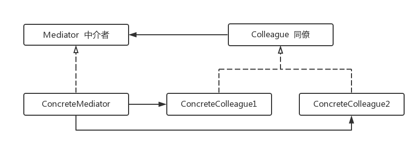

# Objective-C 设计模式

### 对象创建
* [原型模式]()
* [工厂方法](https://github.com/birneysky/DesignPatters/blob/master/README.md#工厂模式)
* [抽象工厂]()
* [生成器]()	
* [单例]()

### 接口适配
* [适配器]()
* [桥接]()
* [外观]()

### 对象去耦
* [中介者]()
* [观察者]()

### 抽象集合
* [组合]()
* [迭代器]()

### 行为扩展
* [访问者]()
* [装饰]()
* [责任链]()

### 算法分装
* [模板方法]()
* [策略]()
* [命令]()

---

#### 工厂模式

各种具体工厂重载其抽象父类中定义的工厂方法，并且这个重载的工厂方法创建自己的产品
 
 抽象产品类(Product)定义了工厂方法创建对象的接口。具体产品类(ConcreteProduct)实现了抽象产品类的接口。Creator定义了返回Product对象的工厂方法。Creator的其他操作可以调用此工厂方法创建Product对象。concreteCreator是Creator的子类。它重载了工厂方法，已返回concreteProduct实例。

---

#### 抽象工厂
在软件设计中，如果客户端想要手工创建一个类的实例，那么客户端首先需要知道这个类的细节。更槽糕的是，一组相关的对象可以在运行时按照不同的标准创建的不一样。此时客户端需要知道全部细节才能创建他们。可以通过抽象工厂来解决这个问题。
抽象工厂提供一个固定的接口。用于创建一些列有关联或者相依存的对象。而不必指定其具体类或者其他创建细节。客户端与从工厂得到的具体对象之间没有耦合。

如上图所示，Client只知道AbstractFactory和AbstractProduct。每个工厂类中，结构与实际操作的细节按黑箱对待。甚至产品也不知道谁将创建它们。只有具体的工厂知道为客户端创建什么，如何创建。工厂方法把实际创建工作推到重载它的子类去完成。在类图中，createProductA 和 createProductB是工程方法。最初的抽象方法什么也不创建。这种抽象十分通用广泛用于任何需要抽象创建过程的场合。

* 软件设计黄金法则：变动需要抽象。

如果有多个类共有相同的行为，但实际实现却不同，即可能需要某种抽象类型作为其父类被继承。抽象类型定义所有相关具体类共有的共同行为。

---

#### 生成器
选择构建自己房子的人会把工程外包给承包商。单一承包商不能建造整个房子，他将其分解为几个部分，然后转包给几个实际的建筑商(builder),他们懂得如何将零部件组装起来。房子由风格、颜色和尺寸各不相同的部件组成。客户告诉承包商房子里都有什么，然后承包商协调各房屋建筑商，决定需要建什么，应该如何建造，如何施工。建房子是一个很复杂的过程，单凭一双手就想建房子，即便可能也非常困难。如果承包商与懂得如何建造房子的建筑商互相协调，这一过程将变得简单而且易于管理。

---

#### 中介者
典型的例子是应用程序中的UI元素。比如有个对话框带有静态文本(label) 列表 文本框 ，以及别的输入框。当列表中一项被选中时，静态文本会被更新为从列表中选定的值。或者当用户在文本框中输入新的值时，需要把这个新的值加入到列表中。当更多的UI元素参与到这一个错综复杂的关系之中时，情况可能变得难以控制。元素之间需要彼此了解并相互操作。最终，会发展到难以复用与维护的地步。所以需要有个交通管制员来管理所有的UI交通。组织各种UI元素在同一个语境下进行交互的集中化的角色，称为中介者。
 
面向对象的设计鼓励把行为分散到不同的对象中。这种分散可能导致对象之间的相互联系，在最糟糕的情况下，所有对象都彼此了解并相互操作。虽然把行为分散到不同对象增强了可复用性，但是增加的相互关联又减少了获得的好处。增加的关联使得对象很难或不能在不依赖其他对象的情况下工作。应用程序的整体行为可能难以进行任何重大修改，因为行为分布于许多对象。于是结果可能就是创建越来越多的子类，以支持应用程序的任何新行为。

Mediator 定义了用户于Colleague交互的一般行为。ConcreteMediator为ConcreteColleague定义了更加具体的行为。
因此可以子类化Mediator，把各种Colleague交互算法应用的相同或者不同的Colleague类型。